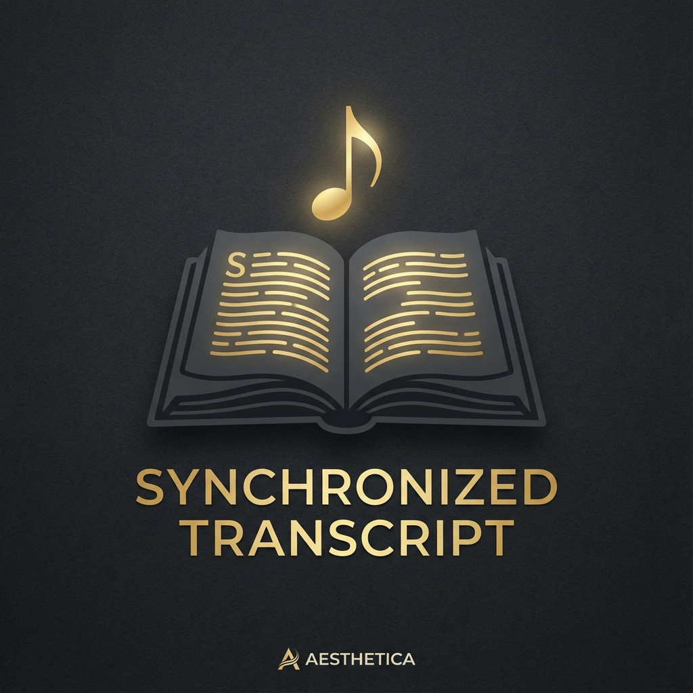

# Gita Wisdom: User Guide & Documentation

Welcome to **Gita Wisdom**, a premium platform designed for the study and contemplation of the Bhagavad Gita Bhakti Shastri course. This guide will walk you through the platform's features and how to make the most of your spiritual learning experience.

---

## 1. Getting Started

When you first open Gita Wisdom, you are presented with a curated list of recordings from the Bhakti Shastri course. Each card displays the session title, speaker, date, and specific "Day" of the course.

- **To Play**: Simply click or tap on any recording card.
- **Auto-Resume**: The app remembers where you left off. If you return to a half-listened session, it will automatically start from your last position.

---

## 2. Navigation & Tools

The top navigation bar provides powerful tools to help you find and organize your study material:

- **🔍 Search**: Click the magnifying glass to expand the search bar. You can search by **Day**, **Verse**, **Topic**, or **Speaker**.
- **⇅ Sort**: Organize the list by Day (Ascending/Descending), Date (Newest/Oldest), or Title (A-Z).
- **❤ Favorites**: Click the heart icon in the navbar to filter and show only your favorite recordings. You can favorite a recording by clicking the heart on its card or in the player.

---

## 3. The Interactive Player
The docked player at the bottom gives you complete control over your listening experience:

- **Playback Speed**: Adjust the speed (0.5x to 2x) for faster study or deep contemplation.
- **Markers**: Add markers at specific timestamps to highlight important verses or explanations.
- **Notes**: Click the **Notes** button to open the notes panel. You can create time-stamped notes that act as bookmarks.

---

## 4. Synchronized Transcripts

One of the most powerful features is the **Interactive Transcript**.

- **Toggle**: Click the scroll icon (**📜**) in the player actions.
- **Real-time Sync**: The transcript automatically highlights the text as it is spoken and scrolls with the audio.
- **Jump to Section**: Click on any text in the transcript to instantly jump the audio to that specific moment.
- **In-Transcript Search**: Use the search bar inside the transcript panel to find specific words within the session.

---

## 5. Mobile Experience
Gita Wisdom is fully responsive. On mobile, the player remains docked for easy access, and panels like Notes and Transcripts slide up from the bottom for a native app-like feel.

---

*“This human form of life is the most valuable asset... utilized for solving the problems of life.”* — **Srila Prabhupada**

Enjoy your study!
